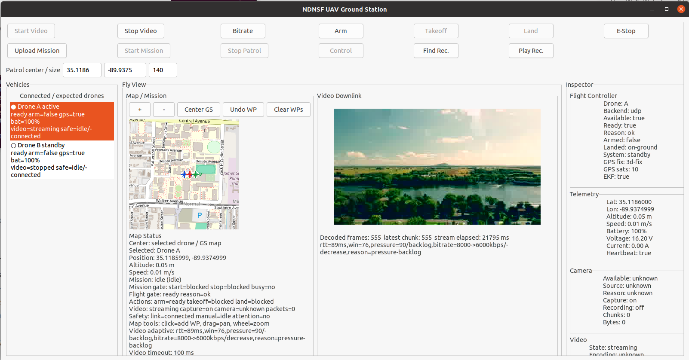

# NDNSF-UAV User Manual



This manual explains how a new user should run the current NDNSF-UAV
applications in the local MiniNDN test environment and how to inspect the
current release packages. The MiniNDN workflow is the primary validated path.
The release packages have been checked for packaging/runtime readiness, but
full physical flight and real USB-camera downlink are still separate hardware
validation steps.

## 1. What The Apps Are

NDNSF-UAV is a service-oriented UAV application built on the NDNSF runtime.
It has three roles:

```text
Controller
  Distributes service permissions and signs controller data.

Ground Station
  Shows the operator GUI. It sends MAVLink commands, starts/stops video,
  displays telemetry, manages patrol missions, and can provide object detection.

Drone
  Runs the drone-side service container. It exposes MAVLink execution,
  telemetry, camera/video control, recording manifest, and mission services.
```

One process can host several services. For example, `UavDroneApp` is not only a
single "drone RPC server"; it is a service container with MAVLink, camera,
telemetry, recording, and mission services.

## 2. Current Supported Test Mode

The currently supported end-to-end test mode is local MiniNDN:

```bash
sudo -E python3 Experiments/NDNSF_UAV_GUI_Minindn.py
```

This starts:

```text
Controller app on one MiniNDN node
Ground Station GUI on another MiniNDN node
Drone app on one or more MiniNDN nodes
optional PX4/jMAVSim SITL, when enabled
optional simulated camera/video input
```

The GUI windows are displayed on the host desktop, while the apps use their
own MiniNDN node NFD sockets. This is the preferred way to test app behavior
before doing real-machine deployment.

## 3. Host Requirements For MiniNDN Testing

The local development machine should have:

```text
Ubuntu Linux host
NFD and ndn-cxx installed and usable
MiniNDN installed
Python 3
X11 desktop session for GUI tests
NDNSF built from this repository
ffmpeg for video/camera simulation
optional PX4-Autopilot checkout for jMAVSim SITL tests
optional USB camera for real camera capture tests
```

The simplest local command is:

```bash
sudo -E python3 Experiments/NDNSF_UAV_GUI_Minindn.py
```

If X11 permission is a problem, run it from the same logged-in graphical
session. The script forwards the host `DISPLAY` and `XAUTHORITY` into MiniNDN.

## 4. Quick Start: GUI Demo

From the repository root:

```bash
./waf build
sudo -E python3 Experiments/NDNSF_UAV_GUI_Minindn.py
```

Wait until the terminal prints:

```text
NDNSF_UAV_GUI_MININDN_READY
```

You should see:

```text
NDNSF UAV Ground Station window
NDNSF UAV Drone window for Drone A
optional Drone B window when multi-drone mode is enabled
optional jMAVSim window when PX4 SITL is enabled
```

To stop the demo, type `exit` in the MiniNDN CLI or close the ground-station
window. If a simulator is running, wait for the launcher to clean it up before
starting another run.

## 5. Ground Station UI Overview

The Ground Station window is organized around operator tasks:

```text
Top toolbar
  Start Video / Stop Video
  Arm / Takeoff / Land
  Upload Patrol Mission / Start Mission / Stop Patrol
  Start Control

Left drone list
  Shows connected/expected drones.
  Selects the active drone for video and manual control.

Map / Mission panel
  Shows the ground-station center and drone markers.
  Allows waypoint placement for patrol missions.

Video panel
  Displays the selected drone's live downlink or replayed recording.

Inspector panel
  Shows telemetry, readiness, flight-controller state, video state,
  service list, estimated RTT, mission state, and logs for the selected drone.
```

The selected drone matters. `Start Video`, manual control, and MAVLink commands
are sent to the selected/target drone. Patrol missions can involve multiple
drones listed in the patrol drone set.

### Ground Station Operating Steps

Use the Ground Station from left to right:

```text
1. Select a drone in the left Vehicles list.
   The highlighted row is the current command target. Video, manual control,
   Arm, Takeoff, and Land apply to this selected drone.

2. Check readiness before flight commands.
   The row and Inspector should show ready, flight-controller available,
   GPS/EKF ready when a real PX4 backend is used, battery state, camera state,
   and link RTT. If the row says waiting-heartbeat or not-ready, wait or fix
   the Drone/PX4 connection before pressing Arm or Takeoff.

3. Use the map for patrol planning.
   Click the map to append waypoints. Use + and - or the mouse wheel to zoom,
   drag the map to inspect nearby areas, Center GS to return to the ground
   station center, Undo WP to remove the last waypoint, and Clear WPs to clear
   the current plan.

4. Upload before starting a patrol.
   Upload Patrol Mission sends the current waypoint set to the selected patrol
   drone group. Start Mission starts the uploaded mission. Stop Patrol sends the
   stop/land path to the active patrol drones. Pressing Start Mission before
   uploading a plan will not create a meaningful patrol.

5. Use video per selected drone.
   Start Video opens the selected drone camera/source and starts the live
   downlink. Stop Video stops that selected drone's live downlink. Switching
   Drone A/Drone B changes which drone the buttons and video state refer to.

6. Use manual control only after readiness is good.
   Arm prepares the flight controller to accept flight commands. Takeoff starts
   autonomous takeoff. Start Control enables the keyboard/gamepad control panel
   for the selected drone. Land tells the selected drone to land. Emergency Stop
   is a Targeted MAVLink safety command and should be treated as a real safety
   action.

7. Read the Inspector when something looks wrong.
   The Inspector shows telemetry details, camera availability, flight-controller
   backend, RTT, service list, mission status, video state, and recent command
   responses. It is the first place to check when a button is disabled or a
   command times out.
```

For real hardware, never test Arm, Takeoff, manual control, or Emergency Stop
with propellers attached until the certificate, route, PX4, battery, GPS/EKF,
and kill-switch checks have been verified in a safe setup.

## 6. Drone UI Overview

The Drone window shows:

```text
drone identity
video state
flight-controller backend state
stream packet/FEC counters
camera availability
flight-controller availability/readiness
recording state when enabled
object-detection alerts when GS detection is used
```

On physical airframe computers the drone can also run in headless mode:

```bash
./build/examples/UavDroneApp --drone-id A --headless
```

For local MiniNDN testing:

```bash
sudo -E python3 Experiments/NDNSF_UAV_GUI_Minindn.py \
  --drone-headless --auto-video-test --auto-stop-seconds 10 --no-cli
```

## 7. Video Workflow

The live video workflow is:

```text
1. Select a drone in the Ground Station left panel.
2. Click Start Video.
3. GS sends an NDNSF video-control service request to that drone.
4. Drone opens its camera/video source and publishes encoded stream chunks.
5. GS fetches chunks, decodes frames, and displays the stream.
6. Click Stop Video to stop the selected drone's live downlink.
```

Drone video source behavior is configured per drone:

```text
video-source auto
camera-v4l2-input-format auto
camera-v4l2-input-size auto
camera-v4l2-input-fps 0
```

`video-source auto` tries a local V4L2 camera first and falls back to the
bundled sample video when no camera is available. To force a camera or file:

```text
video-source /dev/video0
video-source videos/drone.mp4
```

The current video pipeline uses encoded H264-style stream chunks, not raw image
payloads in NDNSF service requests. The GS uses adaptive fetch/skip policy based
on RTT, bitrate, timeout pressure, and decoded/published gap.

## 8. Camera Recording And Repo Playback

Live streaming and local recording are separate decisions.

A drone may be configured to capture and record locally even when GS has not
started live downlink:

```text
camera-capture-on-start true
camera-record-to-local-repo true
camera-record-repo-path /tmp/ndnsf-uav-drone-A-camera.sqlite3
camera-record-object-prefix /example/uav/drone/A/repo/camera/recording
```

Recording data is stored as encrypted chunk objects in the drone-local repo.
GS discovers recordings through the drone's recording manifest service, then
uses the recording helper to fetch and decrypt authorized chunks. Chunk fetching
is a large-data helper path; it is not modeled as a separate NDNSF service.

For local automated testing:

```bash
sudo -E python3 Experiments/NDNSF_UAV_GUI_Minindn.py \
  --drone-headless \
  --auto-recording-playback-test \
  --auto-stop-seconds 8 \
  --no-cli
```

## 9. MAVLink And Flight Control

The Ground Station constructs MAVLink command bytes. The Drone app treats
MAVLink as opaque bytes and forwards them to its configured backend.

Supported backend modes:

```text
mock
  Local mock backend for MiniNDN-only tests.

udp
  UDP MAVLink backend for PX4/jMAVSim SITL or a MAVLink router.

serial
  Serial MAVLink backend for future physical deployment.
```

In the default config:

```text
flight-controller-backend mock
```

For PX4/jMAVSim MiniNDN tests, use:

```bash
sudo -E python3 Experiments/NDNSF_UAV_GUI_Minindn.py \
  --start-jmavsim \
  --auto-telemetry-test \
  --no-cli
```

Basic command flow:

```text
Arm
  Allows the flight controller to accept active flight commands.

Takeoff
  Commands the vehicle to take off to the demo altitude.

Manual Control
  Sends continuous control updates while keys are pressed.

Land
  Commands the vehicle to land.
```

The app displays readiness information before takeoff. A real flight controller
should report heartbeat, GPS/EKF state, battery, mode, arming state, and landed
state. For mock backend runs, some fields are intentionally synthetic.

## 10. Manual Control

Click `Start Control` in the Ground Station to enable keyboard/manual control.
The GUI shows the control layout and highlights active keys.

Typical keyboard mapping:

```text
W / S     pitch forward/back
A / D     roll left/right
Q / E     yaw left/right
R / F     throttle up/down
T         takeoff shortcut
L         land shortcut
```

Manual-control messages use NDNSF Targeted invocation to the selected drone's
MAVLink execution service. The drone forwards the command stream to the flight
controller and returns telemetry/control state in responses.

## 11. Patrol Mission Workflow

The patrol workflow is:

```text
1. Use the map panel to place waypoints.
2. Select patrol drones, normally A,B for local tests.
3. Click Upload Patrol Mission.
4. GS clusters waypoints by drone count.
5. Each drone receives its own mission sector.
6. Click Start Mission.
7. Drones arm/take off/start their assigned mission.
8. Click Stop Patrol to command landing.
```

For local MiniNDN/PX4 smoke testing:

```bash
sudo -E python3 Experiments/NDNSF_UAV_GUI_Minindn.py \
  --auto-patrol-test \
  --multi-drone-gui \
  --start-jmavsim \
  --jmavsim-headless \
  --no-cli
```

The current mission logic is designed for demonstration and SITL regression.
Real airframes need final safety review, geofence policy, lost-link handling,
and no-prop bench testing before physical flight.

## 12. Object Detection

The Ground Station can provide:

```text
/UAV/GS/ObjectDetection
```

When live video is enabled, the drone can periodically ask the GS whether the
decoded stream contains objects such as `Car` or `Truck`. The service request
contains metadata only; it does not upload large image bytes. The GS runs the
detection on the latest decoded frame it already has.

Configured fields in `ground-station.conf`:

```text
yolo-model yolo26n.pt
yolo-script NDNSF-UAV-APP/tools/yolo_detect_once.py
yolo-worker-script NDNSF-UAV-APP/tools/yolo_detect_worker.py
```

If the model or detector is unavailable, the rest of the UAV workflow can still
run; object detection will simply not provide useful detections.

## 13. Configuration Files

There are two levels of configuration.

Deployment-wide runtime config:

```text
config/uav_runtime.conf
```

This controls common names and service names:

```text
group-prefix
controller-prefix
ground-station-identity
drone-prefix
root-identity
trust-schema
service-mavlink-execute
service-mission-assign
service-telemetry-status
service-camera-frame
service-camera-video-control-suffix
service-camera-recording-manifest-suffix
service-gs-object-detection
```

Per-process app configs:

```text
config/ground-station.conf
config/drone-A.conf
config/drone-B.conf
```

These control instance-specific settings:

```text
Drone:
  drone-id
  available
  video-source
  camera capture settings
  recording/repo settings
  flight-controller backend
  MAVLink UDP/serial settings

Ground Station:
  ground-station-identity
  target-drone
  patrol-drones
  timeout and link-state thresholds
  video bitrate/width/policy
  object-detection model/script paths
```

Command-line options override config files. This is useful for MiniNDN smoke
tests and quick experiments.

## 14. Certificates And Trust

NDNSF-UAV uses NDN identities and certificates. For local MiniNDN tests, the
launcher prepares the demo environment. For real deployment, each machine should
own its private key and install certificates signed by the deployment root.

Current recommended certificate model:

```text
Root namespace:
  /example/uav       for local demo
  /muas or another deployment namespace for real deployment

Controller:
  /example/uav/controller

Ground Station:
  /example/uav/gs

Drones:
  /example/uav/drone/A
  /example/uav/drone/B
```

The production trust schema must anchor to the real root certificate. Do not
use `trust any` for physical deployment.

## 15. Useful MiniNDN Smoke Commands

Video start/stop:

```bash
sudo -E python3 Experiments/NDNSF_UAV_GUI_Minindn.py \
  --drone-headless \
  --auto-video-test \
  --auto-stop-seconds 8 \
  --no-cli
```

Repeated Stop Video behavior:

```bash
sudo -E python3 Experiments/NDNSF_UAV_GUI_Minindn.py \
  --drone-headless \
  --auto-video-test \
  --auto-repeat-stop-test \
  --auto-stop-seconds 8 \
  --no-cli
```

Adaptive video pressure:

```bash
sudo -E python3 Experiments/NDNSF_UAV_GUI_Minindn.py \
  --drone-headless \
  --auto-video-test \
  --auto-video-pressure-profile-test \
  --auto-stop-seconds 8 \
  --no-cli
```

Targeted MAVLink command path:

```bash
sudo -E python3 Experiments/NDNSF_UAV_GUI_Minindn.py \
  --auto-mavlink-test \
  --no-cli
```

Telemetry state:

```bash
sudo -E python3 Experiments/NDNSF_UAV_GUI_Minindn.py \
  --drone-headless \
  --auto-telemetry-test \
  --no-start-jmavsim \
  --auto-telemetry-allow-mock-fields \
  --no-cli
```

PX4/jMAVSim telemetry:

```bash
sudo -E python3 Experiments/NDNSF_UAV_GUI_Minindn.py \
  --start-jmavsim \
  --jmavsim-headless \
  --auto-telemetry-test \
  --no-cli
```

Recording discovery/playback:

```bash
sudo -E python3 Experiments/NDNSF_UAV_GUI_Minindn.py \
  --drone-headless \
  --auto-recording-playback-test \
  --auto-stop-seconds 8 \
  --no-cli
```

Mission controls:

```bash
sudo -E python3 Experiments/NDNSF_UAV_GUI_Minindn.py \
  --drone-headless \
  --auto-mission-controls-test \
  --no-cli
```

## 16. Release Packages

The `RELEASE/` directory currently keeps three artifact types:

```text
NDNSF-UAV-ubuntu20-x86_64.tar.gz
NDNSF-UAV-nixos-x86_64.closure.gz
NDNSF-UAV-nixos-aarch64.closure.gz
```

These are release artifacts, not the primary MiniNDN development path. The
current validation status is:

```text
Ubuntu 20.04 x86_64 tarball:
  Built locally and tested with the release MiniNDN recording/playback smoke.
  Expected result: NDNSF_UAV_RECORDING_PLAYBACK_MININDN_SMOKE_OK.

NixOS aarch64 closure:
  Built on an aarch64 Debian 12 GCP host and imported on an Odroid C4 running
  NixOS/aarch64. The bundled executables resolved their packaged libraries,
  the Odroid NFD Unix socket was visible, and the Drone wrapper started far
  enough to auto-select /dev/video1.

Odroid USB camera:
  /dev/video1 reported MJPEG, H.264, and YUYV formats through the bundled
  ffmpeg. A single-frame capture attempt did not complete reliably in this
  test session, so real USB-camera live downlink is not yet marked as passed.

Flight controller / PX4:
  Not validated in this release-package test. The Odroid did not have PX4 or
  a physical flight controller attached for this run, so use the mock backend
  or MiniNDN/PX4 SITL until the hardware path is tested.
```

Use MiniNDN for behavior validation unless you are specifically testing a
release package on a target machine.

## 17. Known Boundaries

Current local testing is useful for:

```text
NDNSF service invocation behavior
Targeted MAVLink command path
GUI workflows
video start/stop and adaptive fetching
camera fallback behavior
repo-backed recording discovery
mission planning and SITL-style patrol tests
telemetry state modeling
```

Current local and release-package testing is not a final substitute for:

```text
propeller-off physical bench test
real wireless loss/interference tests
real GPS/EKF readiness validation
flight-controller safety review
real USB-camera live downlink validation
geofence/lost-link/emergency-stop policy review
airworthiness checks
```

The next real-deployment manual revision should add the full physical workflow
after the GCP build machine, Odroid C4 package, USB camera, NFD routes,
certificates, and PX4 or real flight-controller path are tested together.

## 18. Troubleshooting

No GUI appears:

```text
Run from a graphical login session.
Check DISPLAY and XAUTHORITY.
Try xvfb-run for non-interactive smoke tests.
Check results/uav_gui_minindn/*.log.
```

Drone does not publish video:

```text
Check selected drone in GS.
Check Drone window video state.
Check video-source in drone config.
Check ffmpeg can open the camera or sample video.
Run an auto-video smoke test.
```

USB camera exists but capture hangs:

```text
Check the actual capture device; some boards expose non-camera /dev/video nodes.
On the tested Odroid C4, /dev/video1 was the UVC camera while /dev/video0 was a
decoder device.

The user running Drone must be allowed to read the camera:

  id
  sudo usermod -aG video $USER
  sudo chgrp video /dev/video1
  sudo chmod 660 /dev/video1

After changing groups, start a new login/SSH session. If the camera was
replugged or the driver is confused, refresh UVC once:

  sudo modprobe -r uvcvideo
  sudo modprobe uvcvideo

Then list formats without starting a long capture:

  ffmpeg -f v4l2 -list_formats all -i /dev/video1

If even a low-resolution single-frame capture blocks, treat it as a USB/UVC
driver or camera-state issue rather than a completed NDNSF-UAV live-camera
validation.
```

Stop Video does not appear to stop:

```text
Check whether the selected drone is the one currently streaming.
Duplicate stop requests are safe.
If camera-capture-on-start or camera-record-to-local-repo is enabled,
the capture loop may continue while live downlink stops.
```

Takeoff does not work:

```text
Check flight-controller backend.
Mock backend accepts commands but does not move a simulator.
PX4/jMAVSim requires --start-jmavsim or an already running compatible SITL.
Check readiness, heartbeat, landed state, GPS/EKF, and battery fields.
```

MiniNDN exits but CPU stays high:

```text
Check for leftover PX4/jMAVSim/java processes.
Wait for launcher cleanup.
Use pkill only after confirming no active test is running.
```

Permission or policy failures:

```text
Check runtime namespace values.
Check controller prefix and trust schema.
Check that identities and policy file names match.
For physical deployment, ensure all certificates chain to the same root.
```
