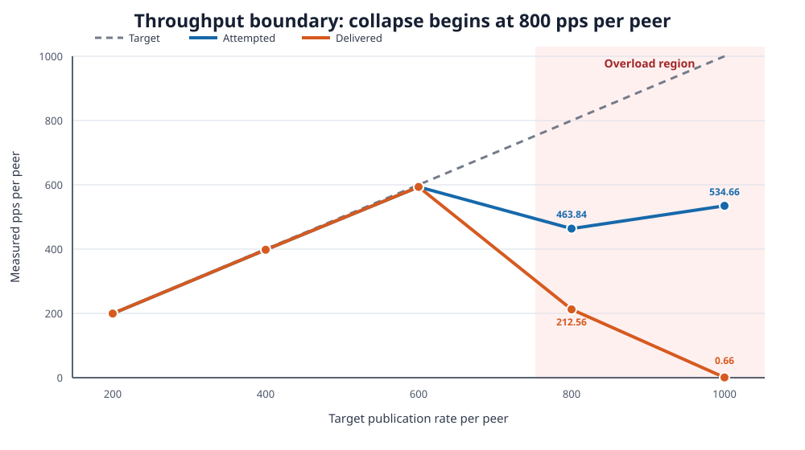
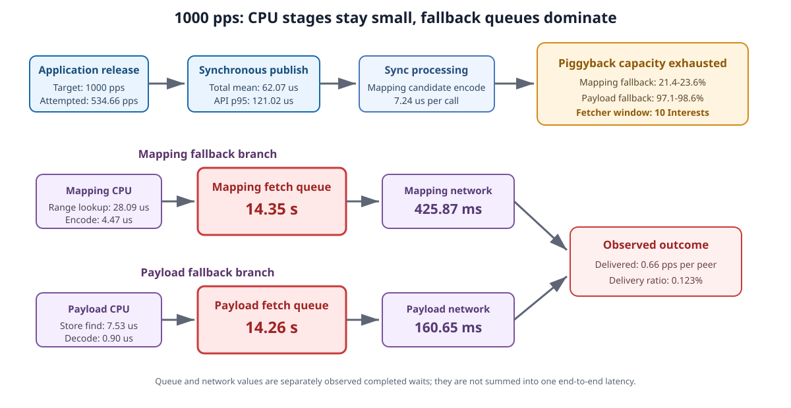
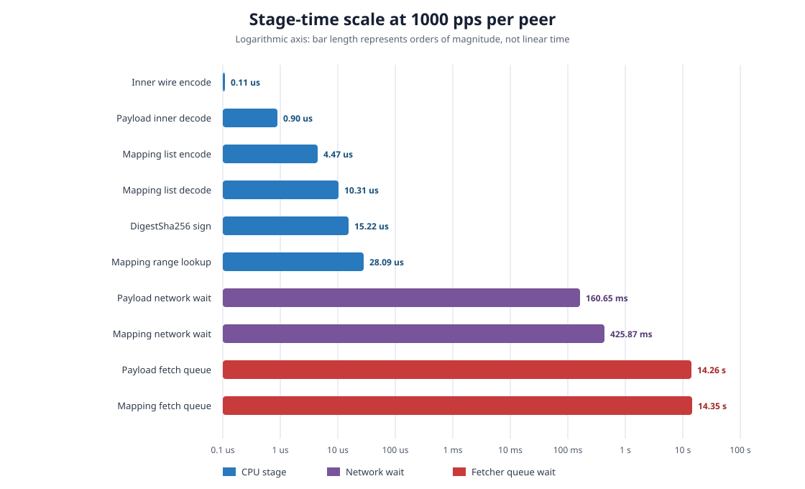

# Spec 133: Synchronous NDN-SVS Stage-Timing Report

## Executive conclusion

The new single-I/O-thread campaign completed all five once-only MiniNDN cells:
200, 400, 600, 800, and 1000 publications/s per peer. The first measured
capacity boundary is **800 pps per peer**.

The result is not “encoding is slow.” Up to 600 pps, both publication and
delivery track the offered rate and delivery remains effectively complete. At
800 pps, Payload fallback rises to 36.8--45.9%, fetch queues grow sharply, and
delivery collapses. At 1000 pps, Payload fallback reaches 97.1--98.6%, Mapping
fallback reaches 21.4--23.6%, and Mapping/Payload fetch-queue residence reaches
about 14.3 seconds per completed wait. The dominant system-level boundary is
therefore **fallback-fetch admission/backlog and the resulting Sync-receive
event-loop starvation on the single Face/io_context execution thread**,
followed by network wait. Mapping encode/decode and Payload decode remain
microsecond-scale.

Within CPU work, the strongest supported publication costs are
`PUB.INNER_SIGN` and `PUB.OUTER_STORE_INSERT`; on the receive/sync side,
`SYNC.MAPPING_CANDIDATE_ENCODE` is the largest recurring CPU contributor.
These CPU stages contribute to load, but they do not explain the multi-second
delivery collapse by themselves.

## Experiment identity and validity

- Historical NDN-SVS base:
  `a9944019f76791773604999f00128057b9534ace`.
- Subject: exact historical base plus only the canonical Boost 1.71 build
  patch and the isolated diagnostics-only profiling patch.
- Execution model: two MiniNDN nodes, two independent processes, and one
  Face/io_context execution thread per process. The application timer,
  synchronous `publish()`, Sync/fetch work, and callbacks all run on that
  thread.
- Topology: one 10 ms one-way, 100 Mbps, zero-configured-loss link.
- Payload: deterministic 256 bytes; compression disabled; HMAC Sync Interest
  signing and `DigestSha256` Data signing. `DigestSha256` is a digest signature
  and does not perform an RSA/ECDSA private-key operation. Validators were
  disabled.
- Timing: 10 s warmup, 60 s measurement, 10 s drain.
- Campaign:
  `results/spec133-svs-sync-stage-profiling/spec133-confirm-io01-20260723T040005Z`.
- Evidence closure: 5/5 terminal receipts `COMPLETE`, 10/10 verified route
  records, 10/10 peer logs with one profile start, one profile stop, and exactly
  81 stage summaries; 810 rate/peer/stage rows; no invalid cell.

The earlier Spec 134 qualification remains `NOT_QUALIFIED` and was not rerun.
Its publication FIB route was absent because the runner attempted to create the
same UDP face twice and ignored the second `Error 409`. The corrected Spec 133
runner creates one face, reuses its numeric face ID for both Sync and remote
node-prefix routes, and verifies both routes before starting either peer.

## Rate boundary

| Target pps/peer | Attempted pps/peer | Attempted / target | Delivered pps/peer | Delivery / attempted | Publish API p95 | Delivery p95 |
|---:|---:|---:|---:|---:|---:|---:|
| 200 | 199.49 | 99.75% | 199.49 | 100.000% | 157.71 us | 17.08 ms |
| 400 | 398.09 | 99.52% | 398.09 | 100.000% | 132.12 us | 19.71 ms |
| 600 | 593.48 | 98.91% | 593.43 | 99.992% | 126.48 us | 20.72 ms |
| 800 | 463.84 | 57.98% | 212.56 | 45.826% | 143.40 us | 18.75 s |
| 1000 | 534.66 | 53.47% | 0.66 | 0.123% | 121.02 us | 13.84 s* |

`*` Only 79 measured deliveries survived at 1000 pps, so its delivery
percentile is heavily survivor/censoring biased.

The synchronous `publish()` API p95 stays below 158 us at every rate. The
collapse therefore occurs after or around publication scheduling and
Sync/fetch processing, not because one `publish()` call suddenly takes
milliseconds.



**How to read the figure.** The attempted and delivered curves follow the
target through 600 pps. At 800 pps, the single event loop can no longer service
both application release timers and incoming Sync/fetch work fast enough:
attempted rate falls to 57.98% of target and delivery falls to 45.826% of what
was attempted. At 1000 pps, the delivered curve is effectively at zero.

## Major flow totals

The following are exact all-call means (`totalDurationNs / calls`) from the
process-end counters. Aggregate parents are not added to leaf CPU demand.

| Flow aggregate or wait | 200 | 400 | 600 | 800 | 1000 |
|---|---:|---:|---:|---:|---:|
| Publication total | 81.93 us | 65.49 us | 61.74 us | 66.10 us | 62.07 us |
| Sync production total | 57.89 us | 56.67 us | 57.82 us | 175.99 us | 166.89 ms* |
| Sync receive total | 96.67 us | 116.76 us | 132.84 us | 6.49 ms | 52.30 ms* |
| Mapping processing total | 23.06 us | 18.66 us | 17.37 us | 12.19 us | 7.14 us* |
| Payload fetcher queue wait | - | 0.004 ms | 0.398 ms | 198.14 ms | 14.26 s |
| Payload network wait | - | 10.61 ms | 10.83 ms | 18.30 ms | 160.65 ms |
| Mapping fetcher queue wait | - | - | - | 6.28 s | 14.35 s |
| Mapping network wait | - | - | - | 2.24 s | 425.87 ms |

`*` At 1000 pps, only 14 Sync-production, 28 Sync-receive, and a reduced set of
completed Mapping operations remain. Their means describe surviving completed
calls, not a stable steady-state service time.

Lock waits remain near zero throughout. They are not the bottleneck.



The figure separates CPU service, fetcher queue residence, and network wait.
The Mapping and Payload branches are alternative/overlapping fallback
observations, so their durations must not be summed as one synthetic
end-to-end latency. Their scale still establishes the bottleneck: microsecond
CPU work feeds queues whose completed waits reach about 14 seconds.

## Publication CPU stages

Values are combined-peer exact mean per call; the final column is the maximum
sampled peer p95 at 1000 pps.

| Stage | 200 mean | 400 mean | 600 mean | 800 mean | 1000 mean | 1000 max p95 |
|---|---:|---:|---:|---:|---:|---:|
| Inner Data build | 1.91 us | 1.45 us | 1.21 us | 1.37 us | 1.23 us | 2.57 us |
| Inner Data `DigestSha256` sign | 17.12 us | 14.70 us | 14.03 us | 16.90 us | 15.22 us | 34.52 us |
| Inner wire encode | 0.18 us | 0.14 us | 0.12 us | 0.12 us | 0.11 us | 0.28 us |
| Outer Data build | 2.37 us | 1.95 us | 1.86 us | 1.90 us | 1.79 us | 5.01 us |
| Outer Data `DigestSha256` sign | 9.49 us | 5.63 us | 5.81 us | 6.25 us | 6.86 us | 15.11 us |
| Outer store insert | 21.73 us | 18.16 us | 17.45 us | 16.05 us | 15.04 us | 36.25 us |
| Outer Face put | 3.52 us | 2.81 us | 2.66 us | 3.46 us | 2.98 us | 8.89 us |

At 1000 pps, inner signing and outer-store insertion each account for about
29% of publication-thread leaf CPU demand. They are the two strongest
CPU-optimization targets. Encoding itself is sub-microsecond and is not the
main publication bottleneck. The signing result is specifically the cost of
ndn-cxx `DigestSha256` packet signing through `KeyChain::sign()`, not RSA or
ECDSA signing.

### Why the publication table is not the system bottleneck

The publication-stage values add to only tens of microseconds because they
measure the synchronous `publish()` call, not all work triggered on the peer by
its own and the remote peer's publications. At 1000 pps, the measured
publication aggregate is 62.07 us. If this call were isolated, its reciprocal
would exceed 16,000 calls/s; therefore this table cannot explain a boundary at
800 pps.

The limiting work occurs later on the same Face/io_context thread:

1. One received Sync update may describe a range of missing sequence numbers.
   `SVSPubSub::updateCallbackInternal()` expands that range item by item and
   inserts every missing publication into `m_fetchMap`.
2. If Mapping/payload bytes did not fit in the 4096-byte Sync
   ApplicationParameters block, `fetchAll()` walks the pending map and submits
   fallback fetches.
3. `Fetcher` admits only 10 simultaneous Interests
   (`m_windowSize = 10`). Additional Mapping or Payload Interests remain in
   `m_interestQueue` until a Data, Nack, or timeout releases a slot.
4. Sync receive processing, pending-map scans, fetch callbacks, subscription
   callbacks, and the application's absolute-deadline publication timer all
   execute on the same I/O thread. A long/bursty receive callback therefore
   delays the next application release even though the eventual `publish()`
   call itself is short.

The 800-pps directional evidence makes this visible:

| 800-pps peer | `SYNC.RECEIVE_TOTAL` exact accumulated duration | Completed Sync receive calls | Publication releases attempted | Publication releases missed |
|---|---:|---:|---:|---:|
| peer-a | 3.89 s | 5,890 | 45,542 / 48,000 | 2,458 |
| peer-b | 61.97 s | 4,254 | 10,119 / 48,000 | 37,881 |

The aggregate duration is callback residence and may include nested work, so it
is not added to leaf CPU totals. Its asymmetry still explains the observed
feedback loop: peer-a publishes a large range; peer-b spends most of its event
loop processing that range and managing fallback work; peer-b then misses its
own release timers. At 1000 pps, peer-a and peer-b miss 18,067 and 37,774 of
60,000 scheduled releases respectively.

This is a queueing/admission bottleneck rather than one expensive instruction:

```text
higher publication rate
  -> bounded piggyback cannot carry every Mapping/payload
  -> missing ranges arrive in bursts
  -> fixed 10-Interest Fetcher window fills
  -> fallback queue and Sync-receive callback residence grow
  -> the shared I/O thread misses publication timers and delays Data handling
  -> still more fallback, asymmetry, and delivery collapse
```

Signing and store insertion remain worthwhile CPU optimizations, but reducing
either by a few microseconds cannot by itself remove a 14-second fallback
queue.



The logarithmic scale makes the separation visible: encoding and decoding are
measured in microseconds, network waits in hundreds of milliseconds, and
overloaded fetch queues in tens of seconds. Optimizing Mapping encoding alone
cannot remove the observed capacity boundary.

## Sync, Mapping, and Payload detail

### Sync

- `SYNC.MAPPING_CANDIDATE_ENCODE` averages 6.60, 4.37, 3.51, 3.33, and
  7.24 us from 200 through 1000 pps. At 1000 pps it contributes about
  22--30% of recurring Face/callback leaf CPU, depending on peer.
- `SYNC.PIGGY_DATA_DECODE_CACHE` remains 9.36--14.70 us mean per call.
- Sync production and receive aggregates expand sharply only after the 800 pps
  boundary. At 1000 pps the small number of completed Sync cycles makes
  sampled tail percentiles unavailable.

### Mapping fallback

At 1000 pps, Mapping CPU work is still small compared with waiting:

| Mapping step | Mean per completed call |
|---|---:|
| Interest build | 1.28 us |
| Query parse | 0.45 us |
| Range lookup | 28.09 us |
| Mapping-list encode | 4.47 us |
| Mapping Data build | 0.88 us |
| Mapping Data sign | 8.76 us |
| Mapping Data Face put | 2.70 us |
| Mapping-list decode | 10.31 us |
| Network wait | 425.87 ms |
| Fetcher queue wait | 14.35 s |

Thus Mapping range lookup is the largest listed Mapping CPU step, but it is
roughly five orders of magnitude smaller than overloaded queue residence.

### Payload fallback

At 1000 pps:

| Payload step | Mean per completed call |
|---|---:|
| Interest build | 1.80 us |
| Provider store find | 7.53 us |
| Provider Face put | 2.78 us |
| Inner Data decode | 0.90 us |
| Subscription callback | 3.85 us |
| Network wait | 160.65 ms |
| Fetcher queue wait | 14.26 s |

Payload decode is not the bottleneck. Queue residence dominates.

## Path transition

| Rate | Mapping fallback | Payload fallback | Nack/timeout observation |
|---:|---:|---:|---|
| 200 | 0% both directions | 0% both directions | none |
| 400 | 0% | 0.027% both directions | none |
| 600 | 0% | 0.601% both directions | none |
| 800 | 0.006% / 0.108% | 45.866% / 36.823% | 187 Mapping and 217 Payload failures in one direction |
| 1000 | 23.596% / 21.408% | 98.600% / 97.133% | no completed failure callbacks before stop; waits are censored |

The two directions become asymmetric at overload. At 800 pps, one peer
attempts 45,542 measured publications while the other attempts only 10,119.
At 1000 pps the split is 41,933 versus 22,226. This is consistent with a
single-thread feedback loop: a peer spending more time receiving/fetching has
less time to service its application publication timer.

## Bottleneck verdict

1. **Primary system boundary: fallback-fetch queue growth.** It appears at
   800 pps together with the delivery collapse and becomes multi-second at
   1000 pps.
2. **Primary publication CPU costs: inner signing and outer-store insertion.**
   Both satisfy the frozen two-signal ranking rule and together consume about
   58% of publication leaf CPU at 1000 pps.
3. **Primary recurring sync CPU cost: Mapping candidate encoding.** It is the
   largest supported Face/callback CPU contributor at 1000 pps.
4. **Not bottlenecks in this campaign:** Mapping list encode/decode, Payload
   decode, and mutex acquisition. Their microsecond or sub-microsecond service
   costs are far below queue/network waits.

The frozen two-signal table labels queue/network waits as `candidate`, not
`supported`, because deterministic 1/100 sampled p95 values are missing or
unrepresentative after overload. The exact all-call totals nevertheless prove
that these queues accumulated very large residence time; this report therefore
separates the system-boundary conclusion from the stricter sampled-tail ranking.

## Evidence limitations

- One once-only observation per rate; no confidence interval or population
  claim.
- Rates ran in ascending order; temporal drift is not randomized.
- The measured subject is the historical synchronous implementation, not the
  later async/parallel implementation.
- Results cover two peers, one link, 256-byte non-segmented payloads,
  compression off, and the frozen HMAC plus `DigestSha256` security settings.
  The measured signing costs do not predict RSA/ECDSA signing cost.
- 2,073 sampled child/aggregate containment mismatches were retained in
  per-stage all-call demand but excluded from aggregate residual attribution.
  Most are caused by a stage ID such as `PUB.SCHEDULER_LOCK_WAIT` being emitted
  at an operation boundary that does not fit the sampled same-trace parent.
- At overload, many waits are censored by the fixed drain/stop boundary.
  Completed-call means and delivery percentiles therefore describe survivors.
- The corrected preflight kept the original rejected receipt. Its first CPU
  calculation incorrectly used the global last sample, after one peer had
  exited. The corrected receipt uses each peer's own first/last valid sample,
  references the original receipt hash, and records `networkRerun=false`.

## Canonical artifacts

- `campaign-summary.json`: campaign validity and boundary.
- `cell-summary.csv`: offered/attempted/delivered rates and application timing.
- `rate-stage-summary.csv`: all 810 rate/peer/stage rows.
- `critical-path-groups.csv`: CPU, lock, queue, and external-wait grouping.
- `path-frequency.csv`: Mapping/Payload piggyback, fallback, Nack, and timeout
  frequencies by direction.
- `bottleneck-ranking.csv`: frozen two-signal ranking.
- `bottleneck-report.md` and `limitations.md`: analyzer-generated summaries.
- `figures/rate-boundary.svg`: target, attempted, and delivered throughput.
- `figures/overload-flow.svg`: CPU, fallback queue, network, and delivery flow.
- `figures/stage-time-scale.svg`: logarithmic comparison across time scales.
