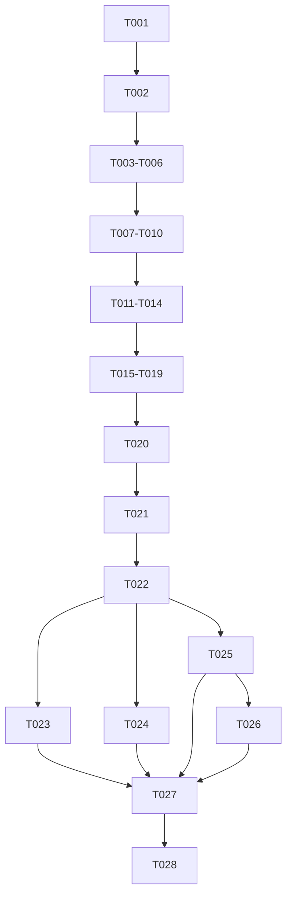

# Tasks: ACK-Driven Canonical ONNX Roles over NDN Dataflow

**Input**: `spec.md`, `plan.md`, `data-model.md`, `implementation-guide.md`,
`experiment-plan.md`, `traceability.md`, and `contracts/`.

**Correction boundary**: Evidence created for a same-Attempt multi-role Provider,
a role spanning Providers, a Provider-local multi-rank role, a cross-Provider
NCCL/socket path, or `LayerReuseFirstStrategy` as topology owner is historical
diagnostic evidence only. No such row closes a task below.

**Execution rule**: All executable code, tests, harnesses, build inputs, and local
Gate A/B/C evidence are complete before T022 freezes a candidate. T023-T028 may
execute the frozen candidate and write evidence/docs only. Any executable or
harness change invalidates T022.

## Phase 1: Authority and Contract Correction

- [X] T001 Preserve the deterministic candidate/run/evidence schema and post-freeze mutation rejection in `tools/ndnsf-di/spec170_evidence.py`, `tests/python/test_spec170_evidence_bundle.py`, and `specs/170-reusable-layer-artifacts/evidence/README.md`; do not reinterpret old pass rows under the corrected architecture.
- [X] T002 Synchronize `spec.md`, `plan.md`, `data-model.md`, `implementation-guide.md`, `quickstart.md`, `experiment-plan.md`, `traceability.md`, and `contracts/` on these invariants: ACK-driven `PreSplitFirstStrategy` default, reuse as cost only, one execution role per stage/rank, one Provider per role, one role per Provider per Attempt, Provider-local ONNX assembly, ONNX Runtime-only deployment, and consumer-pull NDN tensor dataflow; pass structural and semantic Spec Kit audit with no HIGH/CRITICAL issue. See `audit-r5.md` (`CONDITIONAL PASS`, 0 Critical / 0 High).

**BLOCK A0**: T002 passes before source changes are accepted.

## Phase 2: V3 Placement and Ownership

- [X] T003 [US3] Add canonical `ExecutionRole`, `RoleAssemblySpec`, `RoleDataflowContract`, `TensorEndpoint`, and one-to-one role/Provider validation to `NDNSF-DistributedInference/ndnsf_distributed_inference/sdk/placement.py`, `core/hybrid_contracts.py`, `core/decision_validation.py`, and their C++ `NativeExecutionPlan.hpp/.cpp` plus JSON codec; add round-trip and mutation tests in `tests/python/test_spec170_role_dataflow_contract.py` and `tests/unit-tests/distributed-inference-native-plan.t.cpp` for duplicate Provider, duplicate role, role spanning Providers, missing endpoint match, wrong plan/attempt, cycle, and multiple terminal owners.
- [X] T004 [US3] Restore `PreSplitFirstStrategy` as the normal V3 strategy in `app_sdk/application.py`, `app_sdk/client.py`, `app_sdk/placement.py`, `planner/presplit_first.py`, and `planner/layer_reuse_first.py`; generate adapter-certified candidates only after `ACK_CLOSED`, enforce one-to-one ownership, and call reuse scoring only after feasibility. Prove an unmodified public call selects this path, an explicit custom V3 strategy replaces only proposal generation, and V3 failure never falls back to V2 in `tests/python/test_spec170_default_application_path.py` and `test_spec170_v2_v3_compatibility.py`.
- [X] T005 [US3] Update `PlanSealerV3` and `ProviderSelectionProjectionV3` so every Provider projection contains exactly one role, one assembly spec, one dataflow contract, one CPU/single-device binding, and the complete plan/offer/security digests; preserve deterministic sealing and reject opaque executable/runtime content in `sdk/placement.py`, `app_sdk/placement.py`, `core/deployment_control.py`, and `tests/python/test_spec170_plan_sealer.py`.
- [X] T006 [US4] Preserve truthful 0/1/N device offers but admit at most one role/device per Provider/Attempt in Python and native paths (`provider.py`, `ProviderResourceProbe.*`, `NativeProviderReadiness.*`, `NativeProviderHandler.*`); ACK remains side-effect-free and Selection creates only a bounded queue record before JIT admission. Test CPU, one GPU, multi-device visibility, concurrent independent requests, stale device, aggregate-memory rejection, and no silent fallback.

**BLOCK A1**: T003-T006 pass before artifact or dataflow execution work.

## Phase 3: Canonical ONNX Assembly and Runtime

- [X] T007 [US1] Complete the placement-independent canonical ONNX model/profile/layer namespace, normalized graph/initializer/tensor identity, root-last idempotent publication, selective retrieval, and origin/transformation verification in `app_sdk/canonical_artifacts.py`, `artifact_deployment.py`, `adapters/onnx/graph.py`, and `adapters/qwen/canonical_layers.py`; prove two different ACK-driven placements reuse identical canonical objects.
- [X] T008 [US2] Implement Provider-local adapter-certified ONNX graph/initializer assembly from one sealed `RoleAssemblySpec`, private temporary output, full ONNX validation, atomic activation, bounded resource envelopes, and exact reusable identity in `artifact_deployment.py`, `adapters/onnx/executor.py`, `ProviderRoleWorker.*`, and `OnnxRuntimeModelRunner.cpp`; reject missing/overlap, wrong shape/dtype/digest/ABI/adapter, uncertified slicing, and path traversal.
- [X] T009 [US2] Enforce the deployment boundary: provider/application runtime imports ONNX Runtime and standalone tokenizer support but neither PyTorch nor Transformers; exporter/conformance tooling remains separately sealed. Add static distribution scans, import probes, lock checks, and a real minimal-model numerical/token parity test in `tests/python/test_spec170_onnx_runtime_boundary.py` and container tests.
- [X] T010 [US5] Implement exact canonical/assembled/loaded residency, bounded single-flight fetch/build/load, device/topology/fencing/protection invalidation, safe eviction, and feasible-plan reuse scoring in `artifact_deployment.py`, `core/deployment_control.py`, and `planner/layer_reuse_first.py`; a warm exact hit transfers/builds/reloads zero model bytes without changing topology.

**BLOCK A2**: A CPU one-role and multi-stage pipeline oracle pass using Provider-assembled ONNX and ONNX Runtime only.

## Phase 4: Consumer-Pull NDN Tensor Dataflow

- [X] T011 [US3] Implement the exact tensor name grammar and signed `TensorObjectManifest` codec binding producer namespace, requester/request ID, attempt, plan, group/epoch, operation/round, source role/rank, tensor ID/digest, microbatch, and segment in `NativeExecutionPlan.*`, `TensorBundleCodec.*`, Python contracts, and round-trip tests.
- [X] T012 [US3] Implement producer registration for only `mayPublish[]` names and consumer Interest expression for only `mustFetch[]` names, manifest-first bounded segmented retrieval, same-name retransmission, signature/digest/protection validation, duplicate/replay handling, cancellation, and no-progress/hard deadlines in `NdnsfCollaborationDependencyIo.*` and supporting NDNSF/SVS adapters; forbid raw TCP/RPC/RDMA/NCCL and shared-file cross-Provider payload paths.
- [X] T013 [US3] Update `AsyncDataflowRuntime.hpp`, `ProviderRoleWorker.*`, and `OnnxRuntimeModelRunner.cpp` so `waitFor[]` becomes ready only after complete verified tensor reconstruction; execute pipeline dependencies, tensor collective/merge operations, and redistribution without a global model-ready barrier, and emit one terminal Response or one classified failure with zero partial downstream output.
- [X] T014 [US6] Bind dataflow capabilities, encryption/MAC keys, nonce domains, replay fences, permission/grant state, cancellation, and zeroization to exact attempt/plan/role/group/epoch/name identities in `ProtectedRuntime.*`, security contracts, and negative tests; an undeclared name or wrong producer/consumer never reaches ONNX Runtime.

**BLOCK A3**: T011-T014 pass unit and deterministic fault tests before any distributed success claim.

## Phase 5: Integrated and MiniNDN Correctness

- [ ] T015 [US3] Update the reusable `NdnsfIntegrationEnvironment` cases in `tests/integration-tests/` and `contracts/in-process-integration-tests-v1.md`: positive four-Provider/four-role pipeline, strict same-Provider-multi-role and role-spanning-Providers negatives, exact Selection projection parsing, and full REQUEST→ACK_CLOSED→SELECTION→role fetch/publish→RESPONSE lifecycle.
- [ ] T016 [US3] Add deterministic L2 ndn-cxx/ndn-svs packet tests for tensor manifest/segment Interest/Data, drop/reorder/duplicate/repair/replay/cancel, full-name comparison, and first-missing-event diagnostics using production codecs and handlers.
- [ ] T017 [US3] Run real MiniNDN CPU pipeline and two-rank/two-Provider tensor cases with a small inspectable ONNX model; compare full outputs with an unsplit oracle and require matching publish/fetch names for every planned edge in `Experiments/NDNSF_DI_LlmPipeline_Minindn.py` and `tests/python/test_spec170_real_minindn_gate.py`.
- [ ] T018 [US3] Run CPU hybrid `[1,2,1]` with four Providers and `[2,1,2]` with five Providers, one per role; cover redistribution, group readiness, member loss, wrong layout, cancellation, and terminal ownership. Never compress roles onto fewer Providers.
- [ ] T019 [US5] Run three clean-start cold/warm blocks over the corrected normal path, recording selection/assembly/dataflow/response latency, Repo and tensor bytes, cache state, failures, and complete output; report reuse effects separately from placement/dataflow cost.

**BLOCK LOCAL**: T015-T019 pass with immutable commands/hashes before SIF build or Tiger submission.

## Phase 6: Exact Local SIF and Freeze

- [ ] T020 Build one local application SIF from sealed inputs; build `_ndnsf.so` and all container-bound extensions inside the candidate ABI, verify Python/SOABI/EXT_SUFFIX/compiler/glibc/native closure, reject host-built libraries, and prove ONNX Runtime present plus PyTorch/Transformers absent using `packaging/ndnsf-di-container/` gates.
- [ ] T021 Run the exact SIF locally in CPU mode over the corrected one-role projections and four-/five-Provider dataflow cases, plus the complete ownership, name, transport, security, replay, cancellation, and ABI negative matrix; record Gate A/B/C closure without rebuilding.
- [ ] T022 Freeze exactly one source/SIF/dependency/model/canonical-artifact/prompt/security/route/schedule candidate after T001-T021 pass; bind every hash and reject any mismatch as `INVALID_CANDIDATE` in `evidence/frozen-candidate.json` and `evidence/freeze-report.md`.

## Phase 7: Bounded TigerCluster Qualification and Closure

- [ ] T023 [P] [US4] Run the frozen D0 CPU/no-`--nv` job; require truthful zero-device offer and complete CPU-allowed output or explicit GPU-required rejection.
- [ ] T024 [P] [US4] Run the frozen D1 one-GPU job; require exact allocation/offer/Selection binding, one role, complete CUDA ONNX output, and zero CPU fallback.
- [ ] T025 [P] [US3] Run the frozen two-Provider/two-GPU tensor case, one Provider/GPU per rank role, over named NDN tensor objects; require oracle equality and the peer/replay/loss/cancellation negatives. A Provider-local NCCL result cannot satisfy this task.
- [ ] T026 [US3] Run GPU hybrid only when four/five distinct Provider resources are available for `[1,2,1]`/`[2,1,2]`; otherwise retain the passed CPU correctness result and label GPU-scale evidence `BLOCK`, without remapping roles.
- [ ] T027 Synchronize implemented/planned/blocked behavior in English/Chinese README files, `quickstart.md`, the NDNSF-DI design PDF, and proposal slides; separate historical superseded evidence from corrected evidence.
- [ ] T028 Verify every FR-001..FR-075, SC-001..SC-038, and threat row against frozen hashes and evidence; write final PASS/BLOCK to `evidence/closure-report.md`, `traceability.md`, and `results/spec170/README.md`.

## Dependency Graph

## Parallel and Failure Rules

- `[P]` tasks may run in parallel only against the identical frozen candidate.
- T007-T010 may be developed in separate files, but A2 closes only when their
  integrated Provider path passes.
- T011 codec/name work precedes T012 transport; T012 and T013 must converge before
  T015-T018.
- Any failure after T022 is routed to its owning pre-freeze task, invalidates the
  candidate, and requires downstream local gates plus a new freeze. No blind
  remote retry or in-place Tiger patch is permitted.
