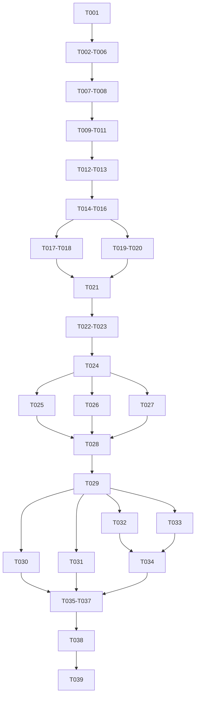

---

description: "Dependency-ordered implementation tasks for Spec 170"
---

# Tasks: Reusable Canonical Model-Layer Artifacts and Adaptive Device Placement

**Input**: `spec.md`, `plan.md`, `research.md`, `data-model.md`,
`experiment-plan.md`, `quickstart.md`, `implementation-guide.md`,
`traceability.md`, and `contracts/`

**Execution contract**: Every behavioral task owns one reviewable outcome,
explicit source paths, its failing/positive tests, and the evidence needed to
close it. Generated `build/lib` copies are never edited. Tasks T001-T028 contain
all executable, security, build, harness, preparation, and local-gate work. T029
is the sole formal freeze cut. T030-T039 may execute the frozen candidate and
write evidence/docs only; any executable/hash change invalidates T029.

**Result retention**: Raw runs use
`results/spec170/<candidate-id>/<gate>/<run-id>/`. Tracked evidence stores only
manifests, hashes, complete summaries, negative rows, and closure reports under
`specs/170-reusable-layer-artifacts/evidence/`.

## Phase 1: Evidence and Identity Foundation

- [X] T001 Define and test the Spec 170 candidate/run/evidence schema, including source, OCI, SIF, dependency lock, model, canonical artifact, prompt corpus, security, route, schedule, freeze timestamp, complete row, negative row, and `INVALID_CANDIDATE` identities in `tools/ndnsf-di/spec170_evidence.py`, `tests/python/test_spec170_evidence_bundle.py`, `tests/fixtures/spec170/candidate.json`, `tests/fixtures/spec170/evidence-schema.json`, `tests/fixtures/spec170/workload.json`, and `specs/170-reusable-layer-artifacts/evidence/README.md`; close when schema round trips deterministically and a post-freeze hash mutation is rejected

**BLOCK F0**: No formal evidence-producing task starts until T001 passes.

## Phase 2: V3 Schema, Offer, Sealing, and Lifecycle Foundation

- [ ] T002 Add strict `DI_PLACEMENT_V3` dispatch, deterministic canonical encoding, and fail-closed V2/V3 decode/cache/evidence separation while preserving explicit V2 bytes in `NDNSF-DistributedInference/ndnsf_distributed_inference/sdk/placement.py`, `NDNSF-DistributedInference/ndnsf_distributed_inference/core/contracts.py`, `NDNSF-DistributedInference/ndnsf_distributed_inference/core/runtime_contracts.py`, `NDNSF-DistributedInference/ndnsf_distributed_inference/core/__init__.py`, `tests/python/test_spec170_placement_v3.py`, and `tests/python/test_spec170_v2_v3_compatibility.py`; prove V3 never auto-falls back to `PREASSEMBLED_PARTITION_SINGLE_DEVICE`
- [ ] T003 Implement one Python/native V3 offer schema for truthful 0/1/N runtime-visible devices, stable `DeviceTopologyProfile`, mutable `DeviceResourceSnapshot`, bounded canonical/assembled/loaded residency proofs, capability predicates, `executionDisposition = ACCEPT_IF_EXACT_REUSE | ACCEPT_WITH_PREPARATION | REJECT`, explicit `preparationAccepted`, and `ackReservation=false` in `NDNSF-DistributedInference/ndnsf_distributed_inference/core/runtime_contracts.py`, `NDNSF-DistributedInference/ndnsf_distributed_inference/provider.py`, `NDNSF-DistributedInference/cpp/ndnsf-di/ProviderResourceProbe.hpp`, `NDNSF-DistributedInference/cpp/ndnsf-di/ProviderResourceProbe.cpp`, `NDNSF-DistributedInference/cpp/ndnsf-di/NativeProviderReadiness.hpp`, `NDNSF-DistributedInference/cpp/ndnsf-di/NativeProviderReadiness.cpp`, `examples/DI_NativeProviderExecutable.cpp`, `examples/wscript`, `packaging/ndnsf-di-container/oci/Dockerfile.gpu`, `packaging/ndnsf-di-container/oci/layered/Dockerfile.app`, `tests/python/test_spec170_runtime_topology.py`, and `tests/unit-tests/distributed-inference-resource-topology.t.cpp`; accept only `(status=true,reuse,false)`, `(status=true,prepare,true)`, and `(status=false,reject,false)`, reject every contradictory tuple before ACK_CLOSED, and require semantic Python/native parity plus exact installed-executable coverage rather than fixture-only JSON
- [ ] T004 Enforce the operator-installed strategy boundary: sanitized immutable `ProviderPlanningViewV3`, bounded `PlacementProposalV3`, deterministic `PlanSealerV3.sealCore`, non-circular `planCoreDigest`, non-executable per-Provider `ProviderGrantViewV1`, `finalizeSecurity(core, canonicalSortedGrantBindings, securityPolicySnapshotDigest)`, final `planDigest`, and Provider-specific Selection projection in `NDNSF-DistributedInference/ndnsf_distributed_inference/sdk/placement.py`, `NDNSF-DistributedInference/ndnsf_distributed_inference/planner/provider_assignment_policy.py`, `NDNSF-DistributedInference/ndnsf_distributed_inference/core/decision_validation.py`, `tests/python/test_ndnsf_di_external_placement_strategy.py`, and `tests/python/test_spec170_plan_sealer.py`; mutation, timeout, cancellation, replay, stale offer, opaque runtime, grant-view-as-Selection misuse, incomplete grant cover, grant substitution, or incomplete graph/rank cover must publish no Selection; semantically equivalent inputs must produce identical core/grant-view/final digests
- [ ] T005 Replace the real V3 ACK reservation path with disposition-aware Selection and the two-stage lifecycle `SELECTION_VALIDATED -> QUEUE_ACCEPTED(no device hold) -> HOST_PREPARING/HOST_READY -> DEVICE_ADMISSION_PENDING -> DEVICE_ADMITTED(fencing token)` while retaining reservation behavior only behind explicit V2 compatibility in `NDNSF-DistributedInference/ndnsf_distributed_inference/provider.py`, `NDNSF-DistributedInference/ndnsf_distributed_inference/core/contracts.py`, `NDNSF-DistributedInference/ndnsf_distributed_inference/core/deployment_control.py`, `NDNSF-DistributedInference/cpp/ndnsf-di/NativeProviderHandler.cpp`, `tests/python/test_spec170_ack_no_reservation.py`, `tests/python/test_spec170_assignment_v3.py`, and `tests/python/test_spec170_admission_lifecycle.py`; prove `ACCEPT_IF_EXACT_REUSE` succeeds only with an exact sealed role artifact/runtime, preparation requires `ACCEPT_WITH_PREPARATION`, overall negative ACK is never selected, and V3 never calls `attach_negotiated_reservation`, creates a lease/queue entry during ACK, holds a partial device set, or accepts a stale fencing token
- [ ] T006 Create the deployment-faithful real MiniNDN runner with wired topology, `getPopen`, real Controller/Requester/three Providers/Repo/security, node-specific logs, bounded readiness, `<10s` `SMOKE_OK`, request-ID continuity, queue/JIT-admission/progress events, complete Request→ACK_CLOSED→Selection→preparation→dependency→Response observation, and cleanup before `ndn.stop()` in `Experiments/NDNSF_DI_LlmPipeline_Minindn.py`, `Experiments/NDNSF_DI_Run_Local_Deployment_Gates.py`, `tests/python/test_spec170_real_minindn_gate.py`, and `tests/fixtures/spec170/minindn-profile.json`

**BLOCK F1**: T002-T006 must pass before canonical artifact or execution work.

## Phase 3: US1 - Canonical Layer Publication

- [ ] T007 [US1] Implement the one normative `/MODEL/v1/NAME/.../MID/.../PROFILE/...` namespace, normalized model/profile/tensor-map identity, canonical model/layer manifests, object/tensor indexes, concurrent idempotent root-last publication, and origin/transformation attestations using the existing Spec 164 public artifact API in `NDNSF-DistributedInference/ndnsf_distributed_inference/app_sdk/canonical_artifacts.py`, `NDNSF-DistributedInference/ndnsf_distributed_inference/adapters/qwen/canonical_layers.py`, `NDNSF-DistributedInference/ndnsf_distributed_inference/adapters/qwen/repo_registration.py`, `NDNSF-DistributedInference/ndnsf_distributed_inference/artifact_deployment.py`, and `tests/python/test_spec170_canonical_layers.py`; reject `REV/CFG/CONTENT` V3 aliases, duplicate/partial/corrupt roots, and semantic-name/content conflicts without changing DistributedRepo placement ownership
- [ ] T008 [US1] Derive different pipeline/tensor assembly references from the same immutable ONNX graph and canonical layer catalog while preserving identical canonical IDs/bytes in `NDNSF-DistributedInference/ndnsf_distributed_inference/splitter.py`, `NDNSF-DistributedInference/ndnsf_distributed_inference/adapters/base.py`, `NDNSF-DistributedInference/ndnsf_distributed_inference/adapters/onnx/graph.py`, `NDNSF-DistributedInference/ndnsf_distributed_inference/adapters/qwen/canonical_layers.py`, and `tests/python/test_spec170_canonical_artifacts.py`; reject illegal, overlapping, missing, or filename-inferred graph cover

**BLOCK US1**: Two legal placements publish zero duplicate canonical bytes.

## Phase 4: US2/US5 - Provider Assembly, Default Wiring, and Reuse

- [ ] T009 [US2] Implement digest-pinned selective canonical retrieval and Provider-local declarative `RoleAssemblySpec`/rank assembly with disk/RAM/device/transient envelopes, private temporary output, complete verification, atomic activation, installed adapter allowlisting, and corrupt/missing/wrong-shape/wrong-ABI cleanup in `NDNSF-DistributedInference/ndnsf_distributed_inference/artifact_deployment.py`, `NDNSF-DistributedInference/ndnsf_distributed_inference/provider.py`, `NDNSF-DistributedInference/ndnsf_distributed_inference/adapters/base.py`, `NDNSF-DistributedInference/ndnsf_distributed_inference/adapters/qwen/canonical_layers.py`, `NDNSF-DistributedInference/ndnsf_distributed_inference/adapters/onnx/executor.py`, `NDNSF-DistributedInference/cpp/ndnsf-di/ProviderRoleWorker.cpp`, and `tests/python/test_spec170_provider_assembly.py`; the ONNX baseline must implement deterministic uncompressed `AssembledOnnxArtifactV1` framing and atomically activate one immutable `.ndnsf-onnx-artifact` file with Provider-signed embedded manifest, signer/prefix/origin/transformation bindings, whole-file object digest, and bounded `INLINE_ONNX | ONNX_EXTERNAL_DATA` layout, catalog it with the normative assembled NDN identity using human model name plus digest and request-independent canonical role/layer coordinates, reject malformed framing/path/entry/range/size/digest/signature violations, unauthorized cross-Provider import, and digest self-reference, check large ONNX by path with colocated external data, and never treat that NDN name as a filesystem path
- [ ] T010 [US2] Rewire the real normal Application path so `app_sdk/application.py` defaults to `LayerReuseFirstStrategy`, `app_sdk/client.py` dispatches V3 canonical ensure, and `app_sdk/placement.py` bypasses `_prepare_artifacts()` role-split materialization for V3 while sealing `RoleAssemblySpec`; preserve the old materializer and `PreSplitFirstStrategy` only for explicit V2 in `NDNSF-DistributedInference/ndnsf_distributed_inference/app_sdk/application.py`, `NDNSF-DistributedInference/ndnsf_distributed_inference/app_sdk/client.py`, `NDNSF-DistributedInference/ndnsf_distributed_inference/app_sdk/placement.py`, `NDNSF-DistributedInference/ndnsf_distributed_inference/planner/layer_reuse_first.py`, `tests/python/test_spec170_default_application_path.py`, and `tests/python/test_spec170_v2_v3_compatibility.py`; instrument zero V3 calls to the legacy role-split materializer and one explicit V2 compatibility call
- [ ] T011 [US5] Implement canonical, assembled-fragment, and loaded-runtime identities; bounded request-completion disk/RAM/GPU reuse; per-device multi-instance residency; boot/process/topology/fencing/protection invalidation; single-flight fetch/build/load; safe eviction; container-exit scratch cleanup versus explicit bounded persistent cache mounts; and deterministic loaded→assembled→canonical→cold feasible ranking tempered by offer disposition, per-phase resources, queue, RTT/bandwidth, deadline, and exact proof in `NDNSF-DistributedInference/ndnsf_distributed_inference/artifact_deployment.py`, `NDNSF-DistributedInference/ndnsf_distributed_inference/core/deployment_control.py`, `NDNSF-DistributedInference/ndnsf_distributed_inference/provider.py`, `NDNSF-DistributedInference/ndnsf_distributed_inference/planner/layer_reuse_first.py`, `tests/python/test_spec170_residency_reuse.py`, and `tests/python/test_spec170_layer_reuse_first.py`; an exact warm `ACCEPT_IF_EXACT_REUSE` hit must transfer/build/reload zero model bytes, while cross-container reuse must fail closed without the configured cache mount

**BLOCK US2/US5 base**: A normal V3 invocation is Provider-assembled and exactly
reusable; V2 remains explicit and disjoint.

## Phase 5: US4 - CPU, Single GPU, and Independent Multi-Device Roles

- [ ] T012 [US4] Establish CPU/no-GPU and exactly-one-GPU V3 execution with `AUTO`/`NONE`/`EXPLICIT_SUBSET`, CPU-allowed complete multi-token output, GPU-required rejection, no silent fallback, and unresolved-subset startup failure in `NDNSF-DistributedInference/ndnsf_distributed_inference/provider.py`, `NDNSF-DistributedInference/cpp/ndnsf-di/ProviderResourceProbe.cpp`, `NDNSF-DistributedInference/cpp/ndnsf-di/NativeProviderHandler.cpp`, `Experiments/NDNSF_DI_LlmPipeline_Minindn.py`, and `tests/python/test_spec170_accelerator_policy.py`
- [ ] T013 [US4] Schedule multiple independent `SINGLE_DEVICE` roles/requests on distinct GPUs under one Provider with per-device ledgers/queues, device-keyed residency, three concurrent invocations, asymmetric envelopes, no ACK hold, queue/JIT atomic admission, and deterministic `2 x 12 GiB != one unsplittable 20 GiB role` rejection in `NDNSF-DistributedInference/ndnsf_distributed_inference/planner/layer_reuse_first.py`, `NDNSF-DistributedInference/ndnsf_distributed_inference/core/decision_validation.py`, `NDNSF-DistributedInference/ndnsf_distributed_inference/core/deployment_control.py`, `NDNSF-DistributedInference/cpp/ndnsf-di/ProviderRoleWorker.cpp`, `NDNSF-DistributedInference/cpp/ndnsf-di/NativeExecutionPlanJson.cpp`, `tests/python/test_spec170_multi_device_provider.py`, and `tests/unit-tests/distributed-inference-device-scheduler.t.cpp`

**BLOCK BASE**: T012 then T013 pass before any multi-rank claim.

## Phase 6: US3 - 3A Provider-Local Tensor Group

- [ ] T014 [US3] Add adapter-certified logical-stage/per-rank recipes where `M_i` is participant count and every tensor is `SHARDED`, `REPLICATED`, `OWNER_ONLY`, or `LOCAL_DERIVED`; reject missing/duplicate/orphan ranks, illegal axes/layout/padding, and incomplete/non-conflicting cover in `NDNSF-DistributedInference/ndnsf_distributed_inference/splitter.py`, `NDNSF-DistributedInference/ndnsf_distributed_inference/adapters/base.py`, `NDNSF-DistributedInference/ndnsf_distributed_inference/adapters/qwen/parallel.py`, `NDNSF-DistributedInference/ndnsf_distributed_inference/core/decision_validation.py`, and `tests/python/test_spec170_local_tensor_group.py`
- [ ] T015 [US3] Seal and JIT-admit one Provider-local two-rank `DEVICE_SET` with a complete local vector/fencing token and no partial hold, aggregate-memory pooling, silent remap, or ACK reservation in `NDNSF-DistributedInference/ndnsf_distributed_inference/planner/layer_reuse_first.py`, `NDNSF-DistributedInference/ndnsf_distributed_inference/core/decision_validation.py`, `NDNSF-DistributedInference/ndnsf_distributed_inference/core/deployment_control.py`, `NDNSF-DistributedInference/cpp/ndnsf-di/NativeExecutionPlan.hpp`, `NDNSF-DistributedInference/cpp/ndnsf-di/NativeExecutionPlanJson.cpp`, and `tests/python/test_spec170_local_device_set.py`
- [ ] T016 [US3] Execute the local two-rank group with ordered authenticated group/epoch readiness, no global model-ready barrier, whole-group cancellation/failure, 50 fixed race seeds per delay/loss class, and an unsplit-stage oracle in `NDNSF-DistributedInference/cpp/ndnsf-di/CollectiveRuntime.hpp`, `NDNSF-DistributedInference/cpp/ndnsf-di/CollectiveRuntime.cpp`, `NDNSF-DistributedInference/cpp/ndnsf-di/ProviderRoleWorker.cpp`, `NDNSF-DistributedInference/cpp/adapters/onnx/OnnxRuntimeModelRunner.cpp`, `tests/unit-tests/distributed-inference-collective-runtime.t.cpp`, and `Experiments/NDNSF_DI_LlmPipeline_Minindn.py`

**BLOCK 3A**: T014-T016 pass together; local collective evidence is not 3B.

## Phase 7: US3 - 3B Cross-Provider Tensor Group

- [ ] T017 [US3] Project one global logical role into one authenticated `ProviderLocalRoleBundle` per Provider, with independent local queue/JIT admission and no cross-offer global `DeviceBinding`, in `NDNSF-DistributedInference/ndnsf_distributed_inference/core/contracts.py`, `NDNSF-DistributedInference/ndnsf_distributed_inference/app_sdk/placement.py`, `NDNSF-DistributedInference/ndnsf_distributed_inference/core/deployment_control.py`, `NDNSF-DistributedInference/cpp/ndnsf-di/NativeProviderHandler.cpp`, and `tests/python/test_spec170_cross_provider_tensor_group.py`
- [ ] T018 [US3] Implement the mandatory cross-Provider `NDNSF_DATA_V1` capability, Requester-sealer CSPRNG epoch key plus per-Provider certificate wrapping/zeroization, signed operation manifest, HKDF per-operation key, unique nonce, AEAD-encrypted/HMAC-signed segments, bounded bitmap/inflight state, exact duplicate/replay, no-progress/hard deadline, cancellation, and whole-epoch failure contract in `NDNSF-DistributedInference/cpp/ndnsf-di/ProviderGroupCoordinator.hpp`, `NDNSF-DistributedInference/cpp/ndnsf-di/ProviderGroupCoordinator.cpp`, `NDNSF-DistributedInference/cpp/ndnsf-di/NdnsfCollectiveControl.hpp`, `NDNSF-DistributedInference/cpp/ndnsf-di/NdnsfCollectiveControl.cpp`, `NDNSF-DistributedInference/cpp/ndnsf-di/NativeProviderSession.cpp`, `tests/unit-tests/distributed-inference-cross-provider-group.t.cpp`, and `Experiments/NDNSF_DI_LlmPipeline_Minindn.py`; compare with the 3A oracle over 50 fixed fault seeds and forbid key/nonce reuse, plaintext wire segments, or partial downstream output

**BLOCK 3B**: T017-T018 pass independently; raw socket/NCCL transport between
Providers cannot substitute for `NDNSF_DATA_V1` evidence.

## Phase 8: US3 - 3C Heterogeneous Pipeline/Tensor Hybrid

- [ ] T019 [P] [US3] Plan `N x {M_i}` with exact graph/rank coverage, `sum(M_i)` ranks, no phantom collective for `M_i=1`, and deterministic sealing for `[1,1,1]`, `[2,2,2]`, `[1,2,1]`, `[2,1,2]`, and the 120-vector corpus in `NDNSF-DistributedInference/ndnsf_distributed_inference/splitter.py`, `NDNSF-DistributedInference/ndnsf_distributed_inference/planner/layer_reuse_first.py`, `NDNSF-DistributedInference/ndnsf_distributed_inference/adapters/qwen/parallel.py`, and `tests/python/test_spec170_hybrid_execution.py`
- [ ] T020 [US3] Implement adapter-certified `1->k`, `k->1`, `k->l`, and equal-degree incompatible-layout redistribution with producer/consumer ranks, layout, operation, integrity, epoch, temporary memory, completion, replay, and failure semantics in `NDNSF-DistributedInference/ndnsf_distributed_inference/core/contracts.py`, `NDNSF-DistributedInference/ndnsf_distributed_inference/adapters/base.py`, `NDNSF-DistributedInference/ndnsf_distributed_inference/adapters/qwen/parallel.py`, `NDNSF-DistributedInference/cpp/ndnsf-di/NativeExecutionPlan.hpp`, `NDNSF-DistributedInference/cpp/ndnsf-di/AsyncDataflowRuntime.hpp`, and `tests/unit-tests/distributed-inference-async-runtime.t.cpp`
- [ ] T021 [US3] Close end-to-end 3C locally by running pipeline/tensor controls and `[1,2,1]`/`[2,1,2]` through data-driven preparation/execution, canonical IDs, sharded state, complete oracle output, scheduler-reaction instrumentation, and omitted/duplicate/wrong redistribution, delayed-rank, cycle, loss, and cancellation faults in `Experiments/NDNSF_DI_LlmPipeline_Minindn.py`, `NDNSF-DistributedInference/cpp/adapters/qwen/QwenGenerationSession.cpp`, `NDNSF-DistributedInference/cpp/ndnsf-di/AsyncDataflowRuntime.hpp`, `tests/python/test_spec170_hybrid_execution.py`, and `tests/python/test_spec170_real_minindn_gate.py`

**BLOCK 3C**: T019-T021 pass; no global readiness barrier or partial output.

## Phase 9: US6 - Protected Artifacts and Failure Evidence

- [ ] T022 [US6] Implement the signed `GrantRequestV1` over `ProviderGrantViewV1` and named `KeyGrantV1` acquisition bound to `planCoreDigest` before security finalization/Selection, complete one-grant-per-selected-protected-Provider cover, configured policy-authority trust/endpoint, Provider-identity unwrap, `DISK_CIPHERTEXT_ASSEMBLED` authorization, domain-separated per-assembly/per-entry AEAD keys with unique nonce pairs and ciphertext whole-file identity, signed `RevocationStateV1` checks at unwrap/reuse/JIT admission/`nextCheckAt`, protection/revocation sequence, `PlaintextLeaseRegistry` coverage for materialized ONNX files, `NO_GRANT -> ... -> ZEROIZED` lifecycle, loaded-runtime fencing, immediate active-request cancellation after observed revocation, host/device/file zeroization or context destruction, and encrypted-object retention in `NDNSF-DistributedInference/ndnsf_distributed_inference/app_sdk/canonical_artifacts.py`, `NDNSF-DistributedInference/ndnsf_distributed_inference/artifact_deployment.py`, `NDNSF-DistributedInference/ndnsf_distributed_inference/core/protected_artifacts.py`, `NDNSF-DistributedInference/ndnsf_distributed_inference/security/artifact_policy_authority.py`, `NDNSF-DistributedInference/cpp/ndnsf-di/ProtectedRuntime.hpp`, `NDNSF-DistributedInference/cpp/ndnsf-di/ProtectedRuntime.cpp`, `tests/fixtures/spec170/artifact-policy.json`, `tests/python/test_spec170_artifact_security.py`, and `tests/unit-tests/distributed-inference-protected-runtime.t.cpp`; cover missing/untrusted authority, wrong core/grant-view/Provider, grant-view replay or use as Selection, incomplete/duplicate/substituted grant cover, grant failure before Selection, wrong recipient, plaintext protected bundle, KDF-domain/nonce reuse, unauthorized disk tier, expiry, revocation, stale/unreachable revocation state, replay, epoch rotation, restart, incomplete registry, zeroization failure, and stale-runtime advertisement without changing Spec 164 transport ownership
- [ ] T023 [US6] Preserve request ID plus attempt/plan/rank/group/epoch, queue state, admission fencing token, protection epoch, and last progress through transfer, assembly, load, collective, cancellation, retry, zeroization, and terminal Response/failure; enforce hard plus no-progress deadlines and reject duplicate/stale/orphan output in `NDNSF-DistributedInference/ndnsf_distributed_inference/runtime_v1_evidence.py`, `NDNSF-DistributedInference/cpp/ndnsf-di/ExecutionEvidence.hpp`, `NDNSF-DistributedInference/cpp/ndnsf-di/ExecutionEvidence.cpp`, `NDNSF-DistributedInference/cpp/ndnsf-di/NativeProviderHandler.cpp`, and `tests/python/test_spec170_failure_evidence.py`

**BLOCK SECURITY**: Protected and unprotected profiles both fail closed with
narrow evidence; protected scope is not optional.

## Phase 10: Build, Local Gates, and Pre-Freeze Closure

- [ ] T024 Package the final source and real native V3 ACK/runtime path once into OCI/SIF; finish all Slurm/Apptainer rendering for no GRES/no `--nv`, one/two GPU `--nv`, one-Provider/two-GPU and two-Provider topologies; create the immutable D0/D1/D2a/D2b/D2h job files and exact-SIF parity tests in `packaging/ndnsf-di-container/lib/adapters/slurm_apptainer.py`, `packaging/ndnsf-di-container/lib/spec170_allocation_topology.py`, `packaging/ndnsf-di-container/adapters/slurm-apptainer/templates/ndnsf-di.sbatch.in`, `packaging/ndnsf-di-container/adapters/slurm-apptainer/scripts/run-container.sh`, `specs/170-reusable-layer-artifacts/jobs/gate-d0-cpu.sbatch`, `specs/170-reusable-layer-artifacts/jobs/gate-d1-single.sbatch`, `specs/170-reusable-layer-artifacts/jobs/gate-d2a-local-two-gpu.sbatch`, `specs/170-reusable-layer-artifacts/jobs/gate-d2b-cross-provider.sbatch`, `specs/170-reusable-layer-artifacts/jobs/gate-d2h-hybrid.sbatch`, `tests/container/unit/test_spec170_allocation_topology.py`, and `tests/container/unit/test_spec170_exact_sif_gate.py`; this is the last task allowed to change build/install/job/harness code
- [ ] T025 Execute local Gate A over every V3 schema, namespace, default-path, ACK/no-reservation, queue/JIT admission, canonical/assembly/reuse, protected security, 3A/3B/3C, `NDNSF_DATA_V1`, V2 separation, and 120-vector/mutation test, including the reusable preconfigured `NdnsfIntegrationEnvironment` bootstrap/READY boundary and bounded L1/L2 ndn-cxx `DummyClientFace` plus ndn-svs `SVSPubSub` integrated harness specified in `contracts/in-process-integration-tests-v1.md` and `contracts/in-process-environment-v1.md`; write immutable command/hash/results to `specs/170-reusable-layer-artifacts/evidence/gate-a.md` without changing tested source
- [ ] T026 Execute local Gate B with the minimal real Qwen model and the fixed 8-GiB-host profile: one three-stage CPU pipeline, three real MiniNDN Providers each owning one fragment, and three concurrent normal-default V3 invocations that all select those Providers and single-flight/reuse each local fragment rather than load three full models; require complete multi-token responses, request-ID/progress/scheduler-reaction evidence, and for `P01-P05` exactly three clean-start blocks of one measured cold + one unmeasured warmup + five measured warm requests; generate the predeclared hierarchical-bootstrap and failure intervals using the existing harness in `Experiments/NDNSF_DI_Run_Local_Deployment_Gates.py` and write `specs/170-reusable-layer-artifacts/evidence/gate-b-minindn.md` without modifying the harness
- [ ] T027 Execute Gate C using the exact T024 SIF in CPU/no-GPU mode plus bounded available CUDA preflights; prove installed native/Python V3 offer parity, no hidden test defaults, same contracts/model/artifact/security/routes, and exact allocation visibility in `specs/170-reusable-layer-artifacts/evidence/gate-c-sif.md` without rebuilding
- [ ] T028 Execute the deterministic security/transport/proposal mutation corpus and 50-seed admission/rank-delay/loss classes across applicable local/SIF gates; require zero unexpected outcomes/deadlocks, verify every H1-H10 and SC-001..SC-035 pre-freeze traceability row, and write `specs/170-reusable-layer-artifacts/evidence/security-failure-matrix.md` plus `specs/170-reusable-layer-artifacts/evidence/pre-freeze-closure.md`; any gap returns to T002-T024

**BLOCK PRE-FREEZE**: T025, T026, T027, and T028 all PASS. Exploratory rows,
fixture-only native wiring, or fewer than three cold/warm blocks do not pass.

## Phase 11: Sole Candidate Freeze

- [ ] T029 Freeze exactly one source/OCI/SIF/dependency/model/canonical-artifact/prompt/security/route/schedule candidate after T001-T028 pass; bind every executable/build/harness hash and Gate A/B/C closure in `specs/170-reusable-layer-artifacts/evidence/frozen-candidate.json` and `specs/170-reusable-layer-artifacts/evidence/freeze-report.md`; verify the post-freeze command rejects every mismatched hash as `INVALID_CANDIDATE`

**FREEZE RULE**: T030-T039 may not edit source, security, build/install,
experiment harness, model, canonical payload, or workload. A required change
invalidates T029 and routes to its owning task before a new freeze.

## Phase 12: US4 TigerCluster Qualification of the Frozen Candidate

- [ ] T030 [P] [US4] Execute the T024/T029-frozen `jobs/gate-d0-cpu.sbatch` with no GRES/no `--nv`; require zero-device signed offer, CPU-allowed complete output or GPU-required rejection, and no phantom device; write only `specs/170-reusable-layer-artifacts/evidence/tiger-d0.md`
- [ ] T031 [P] [US4] Execute the frozen `jobs/gate-d1-single.sbatch` with exactly one GPU/`--nv`; require allocation, UUID map, signed offer, Selection, admission fence, loaded-runtime identity, complete minimal-model CUDA output, and CPU fallback zero; write only `specs/170-reusable-layer-artifacts/evidence/tiger-d1.md`
- [ ] T032 [P] [US4] Execute the frozen `jobs/gate-d2a-local-two-gpu.sbatch` with two GPUs visible to one Provider and separately validate two independent single-device roles plus one 3A local two-rank role; record `BLOCK` rather than substitute two Providers; write only `specs/170-reusable-layer-artifacts/evidence/tiger-d2a.md`
- [ ] T033 [P] [US4] Execute the frozen `jobs/gate-d2b-cross-provider.sbatch` with two Provider runtimes restricted to one allocated GPU each; require two offers/bundles, `NDNSF_DATA_V1` capability/segments, independent local admission, complete two-rank output, and peer/replay/partial-output negatives; write only `specs/170-reusable-layer-artifacts/evidence/tiger-d2b.md`
- [ ] T034 [US4] After T032 and T033 pass, execute the frozen `jobs/gate-d2h-hybrid.sbatch` with mappings `[1,2,1]: P0/G0={S0R0,S1R0}, P1/G1={S1R1,S2R0}` and `[2,1,2]: P0/G0={S0R0,S1R0,S2R0}, P1/G1={S0R1,S2R1}`; require `EXCLUSIVE_PLAN` summed envelopes, ranks, collectives, redistribution, scheduler reaction, oracle, and failure evidence, otherwise retain `BLOCK`; write only `specs/170-reusable-layer-artifacts/evidence/tiger-d2h.md`

## Phase 13: Frozen Cross-Gate Evidence and Closure

- [ ] T035 [US5] Execute the already-implemented reuse strategy matrix across CPU, single, independent, 3A, 3B, and 3C candidates; verify deterministic loaded→assembled→canonical→cold order, no ACK hold, queue/JIT admission, no V2 fallback, and route any failure back before a new freeze; write only `specs/170-reusable-layer-artifacts/evidence/reuse-strategy-matrix.md`
- [ ] T036 [US5] Execute the frozen repeated workload on every accepted remote configuration using the same `P01-P05`, three-block cold/warm sequence, 10,000-iteration hierarchical bootstrap, paired effect/equivalence estimand, Holm family, and exact failure intervals already validated by T026; write only `specs/170-reusable-layer-artifacts/evidence/cold-warm-summary.md`
- [ ] T037 [US6] Execute the frozen applicable proposal, admission, transport, protected-profile, replay, cancellation, and no-progress negative cases; preserve zero partial output, zero stale runtime hit, and narrow terminal evidence; write only `specs/170-reusable-layer-artifacts/evidence/security-failure-matrix.md`
- [ ] T038 Synchronize public implemented/planned/blocked behavior without affecting the candidate in `NDNSF-DistributedInference/README.md`, `NDNSF-DistributedInference/README_ch.md`, `examples/python/NDNSF-DistributedInference/llm_pipeline/README.md`, and `specs/170-reusable-layer-artifacts/quickstart.md`; document V3 default, explicit V2 profile, queue/JIT lifecycle, protected state, `NDNSF_DATA_V1`, and independent D gates
- [ ] T039 Verify every FR-001..FR-071, SC-001..SC-035, and H1-H10 row against the frozen hashes and evidence; retain independent 3A/3B/3C/D2a/D2b/D2h outcomes, prune only superseded raw diagnostics, and write final PASS/BLOCK in `specs/170-reusable-layer-artifacts/evidence/closure-report.md`, `specs/170-reusable-layer-artifacts/evidence/traceability.md`, and `results/spec170/README.md`

## Dependency Graph

## Parallel and Blocking Rules

- `[P]` means independent execution/evidence only after all incoming graph edges.
- T019 may proceed beside later 3A/3B work only after T014's recipe contract is
  stable; T021 still requires T018 and T020.
- T025-T027 may execute in parallel against the unchanged T024 candidate, but
  T028 and T029 require all three.
- T030-T033 are independent Slurm claims from one freeze. T034 requires both D2a
  and D2b because its fixed mapping exercises local co-residency and cross-
  Provider transport.
- A failure after T029 never authorizes an in-place fix. Record it, identify the
  owning pre-freeze task, invalidate the candidate, fix locally, rerun its
  downstream local gates, and create a new T029 identity.

## Implementation Strategy

1. Complete F0/F1 and the normal default V3 path before optimizing placement.
2. Close canonical publication and Provider assembly on CPU/single-device before
   multi-rank behavior.
3. Close 3A, 3B, and 3C as independent semantics; never infer one from another.
4. Make protected security, native/SIF wiring, and local statistical gates part
   of the candidate, not post-hoc evidence work.
5. Freeze once, then run remote claims without rebuilding or re-preparing.

Each task is intentionally a behavioral unit: contract, implementation, focused
test, and closing evidence remain together when they share owner and gate.
