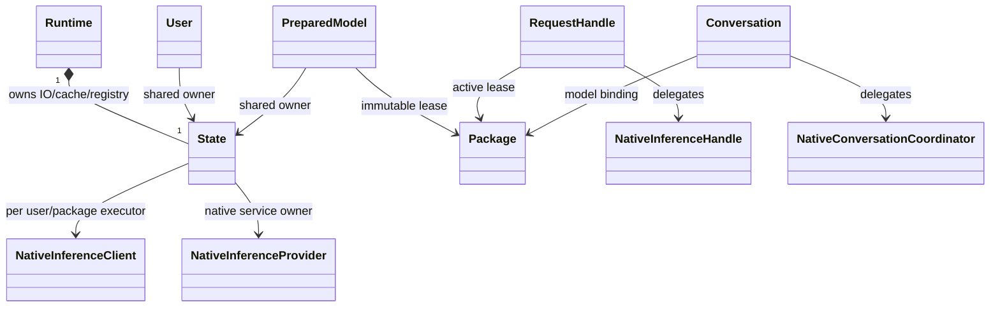
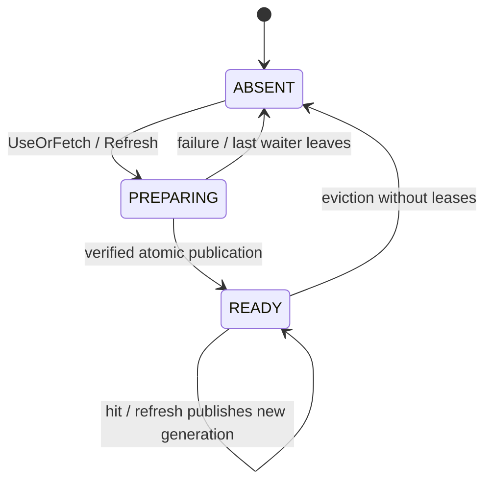
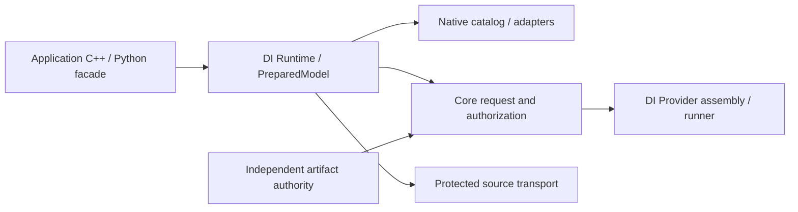
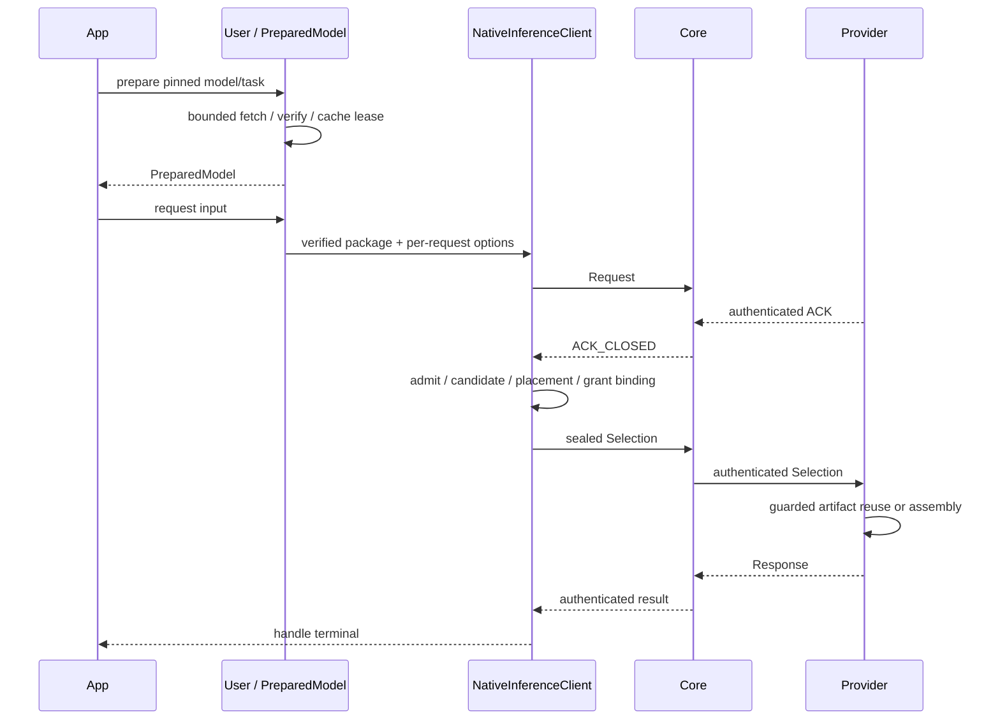

# Data Model

[C-08 F01–F16](contracts/code-design.md#private-types-and-important-fields)是内部State/Package/job/waiter/subscription/reader/Provider字段与owner权威；本页与C-07保留领域/公开类型说明。

详细字段唯一契约见 [C-01](contracts/public-api.md)、[C-02](contracts/preparation.md)、[C-03](contracts/execution.md)。

| Entity | Authority | Identity / mutable state | Persistence |
| --- | --- | --- | --- |
| Runtime State | native IO/lifecycle owner | config principal/trust domain、closed、active operations | 配置引用；不存 authority 私钥 |
| Preparation job | native cache owner | preparation key、generation、job deadline、waiters | 本期内存；取消/失败移除 |
| Package | verified catalog owner | inspected model、catalog digest、source lease、splitter、state mapping | 复用 source store；不新建缓存 DB |
| PreparedModel | User::prepare | Package lease + 每调用 receipt | 不序列化 owner 指针 |
| RequestHandle | NativeInferenceHandle | owner-generated request/attempt、terminal、event history | 复用既有请求持久边界 |
| Conversation | NativeConversationCoordinator | conversation ID、committed checkpoint、one active turn | 既有加密 journal/原子 export |
| Provider artifact entry | authenticated assembly owner | recipe/role/backend/security key、lease | protected store 保留密文 |

## Ownership Diagram

registry 到子 owner 使用 weak reference；图中的 shared owner 不允许形成反向强引用环。

## Preparation State Diagram

刷新 job 和旧 READY 可以同时存在；见 C-02，图不表示先驱逐旧对象。

## Component and Sequence Views

图为PLANNED层次视图，不替代grant/seal和会话事务的详细C-03契约。

## Public SDK Revision

C-05/C-06增加ModelRegistration（启动冻结key→配置）、ModelCapabilities（只读schema）、PreparationHandle（独立waiter）、Result/DiError（公开值类型）、EventReader（可靠单游标）和RequestDiagnostics（观察丢弃计数）。
ProviderConfig/ConversationCheckpoint为opaque对象；authority/coordinator/commit回调不透入application头；Python没有独立领域状态。

C-07将初版CompletionSubscription统一为Subscription，适用于完成/诊断/单次read；新增有限resultAsync等待，不产生第二operation。
Runtime外壳析构close，子对象只保留安全State；PreparationHandle最后用户副本释放取消该waiter，RequestHandle析构不cancel。完整所有权表见[C-07](contracts/api-catalog.md)。
